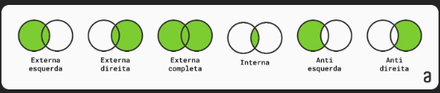

# MESCLAGEM DE DADOS NO POWER QUERY

**Esquerda Externa (Left Outer Join)**: Retorna todas as linhas da tabela esquerda e as linhas correspondentes da tabela direita com base em um critério de correspondência dos relacionamentos entre chaves primárias e estrangeiras das tabelas. Se não houver correspondência na tabela direita, os valores serão preenchidos com nulos.

**Direita Externa (Right Outer Join)**: Retorna todas as linhas da tabela direita e as linhas correspondentes da tabela esquerda com base em um critério de correspondência. Se não houver correspondência na tabela esquerda, os valores serão preenchidos com nulos.

**Completa Externa (Full Outer Join)**: Retorna todas as linhas das duas tabelas, combinando registros com base em um critério de correspondência. Se não houver correspondência em uma das tabelas, os valores correspondentes serão preenchidos com nulos.

**Interna (Inner Join)**: Retorna apenas as linhas correspondentes das duas tabelas com base em um critério de correspondência. As linhas não correspondentes são excluídas do resultado final da mesclagem.

**Anti Esquerda (Left Anti Join)**: Retorna apenas as linhas da tabela esquerda que não possuem correspondência com base em um critério de correspondência. As linhas correspondentes da tabela direita são excluídas do resultado.

**Anti Direita (Right Anti Join)**: Retorna apenas as linhas da tabela direita que não possuem correspondência com base em um critério de correspondência. As linhas correspondentes da tabela esquerda são excluídas do resultado.

---
